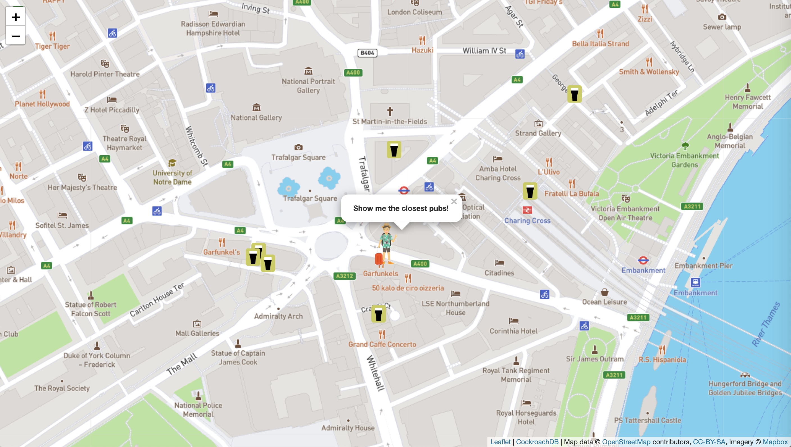

# CockroachDB Geo Tourist

## Use the spatial features in CockroachDB to find pubs, restaurants, cafes, etc.


(App shown running on a laptop)

This is a simple Python Flask and Javascript app which illustrates some of the
new spatial capabilities in CockroachDB 20.2.  The scenario is this: in the Web
app, an icon represents the user, and this user is situated at a location
randomly chosen from a set of destinations, each time the page is refreshed.
Then, an HTTP POST is made from the Javascript front end, including the user's
location and the type of _amenity_ to search for.  Within the Python Flask
app, those values are featured in a SQL query against a CockroachDB instance
loaded with spatial data.  This query uses the following spatial data types,
operators, and indexes to find and return a set of the nearest amenities,
sorted by distance:

1. `GEOGRAPHY`: the data type to represent each of the `POINT` data elements associated with the amenity
1. `ST_Distance`: used to calculate the distance from the user to each of these locations
1. `ST_Y` and `ST_X`: are used to retrieve the longitude and latitude of each of these points, for plotting onto the map
1. `ST_DWithin`: used in the `WHERE` clause of the SQL query to constrain the results to points within 5km of the user's location
1. `ST_MakePoint`: converts the longitude and latitude representing the user's location into a `POINT`
1. A GIN index on the `ref_point` column in the `osm` table speeds up the calculation done by `ST_DWithin`
1. `ST_GeoHash`: to create the primary key for the `tourist_locations` table

These types and operators, together with the GIN index, will be familiar to users of
[PostGIS](https://postgis.net/), the popular spatial extension available for
PostgreSQL.  In CockroachDB, this layer was created from scratch and PostGIS
was not used, though its API was preserved.

One aspect of CockroachDB's spatial capability is especially interesting: the
way the spatial index works.  In order to preserve CockroachDB's unique ability
to scale horizontally by adding nodes to a running cluster, its approach to
spatial indexing is to decompose of the space being indexed into buckets of
various sizes.  Deeper discussion of this topic is available
[in the docs](https://www.cockroachlabs.com/docs/v20.2/spatial-indexes) and
[in this blog post](https://www.cockroachlabs.com/blog/how-we-built-spatial-indexing/).


(App running in an iPhone, in Safari)

## Data

The data set is a sample of an extract of the OpenStreetMap
Planet Dump which is accessible from [here](https://wiki.openstreetmap.org/wiki/Planet.osm).
The `planet-latest.osm.pbf` file was downloaded (2020-08-01) and then processed
using [Osmosis](https://github.com/openstreetmap/osmosis/releases) as
documented in [this script](./osm/planet_osm_extract.sh).  The bounding box
specified for the extract was `--bounding-box top=72.253800 left=-12.666450 bottom=33.120960 right=34.225994`,
corresponding to the area shown in the figure below.  The result of this operation
was a 36 GB Bzip'd XML file (not included here).  This intermediate file was then
processed using [this Perl script](./osm/extract_points_from_osm_xml.pl), with the
result being piped through grep and, finally, gzip to produce a [smaller data
set](https://storage.googleapis.com/crl-goddard-gis/osm_475k_eu.txt.gz) containing
a smaller set of points which lie in the areas the app focuses on.


[DDL and sample SQL queries](./osm/osm_crdb.sql): The data set is loaded into
one table which has a primary key and one secondary index.  Here is the DDL:

```
DROP TABLE IF EXISTS osm;
CREATE TABLE osm
(
  id BIGINT
  , date_time TIMESTAMP WITH TIME ZONE
  , uid TEXT
  , name TEXT
  , key_value TEXT[]
  , ref_point GEOGRAPHY
  , geohash4 TEXT -- First 4 characters of geohash, corresponding to a box of about +/- 20 km
  , CONSTRAINT "primary" PRIMARY KEY (geohash4 ASC, id ASC)
);
CREATE INDEX ON osm USING GIN(ref_point);
```
**NOTE:** `./load_osm_stdin.py` creates the `osm` table and the GIN index if they don't already exist.

There is an additional table, `tourist_locations` (see below), which contains the set of places where
our "tourist" might be situated when the page loads.  This is populated by `load_osm_stdin.py`.  Only
locations for which `enabled` is `TRUE` will be used, so the number of possible locations can be
managed by manipulating the existing rows in this table, or by adding new ones, though the data set
may need to be expanded to accommodate the new values.  The DDL for this table contains features
worth mentioning: the goal was to use the `geohash` column as the primary key, but to also derive
this value from the `lat` and `lon` values; lines 7 and 8 show how this can be acheived within
CockroachDB:

```
1	CREATE TABLE tourist_locations
2	(
3	  name TEXT
4	  , lat FLOAT8
5	  , lon FLOAT8
6	  , enabled BOOLEAN DEFAULT TRUE
7	  , geohash CHAR(9) AS (ST_GEOHASH(ST_SETSRID(ST_MAKEPOINT(lon, lat), 4326), 9)) STORED
8	  , CONSTRAINT "primary" PRIMARY KEY (geohash ASC)
9	);
```

[The Flask app](./map_app.py) runs one of two variations of a query, depending
on whether the environment variable `USE_GEOHASH` is set and, if so, its value
(`true` or `false`), as shown in the following code block (line numbers have
been added here).  The main difference is that, when `USE_GEOHASH` is set to
`true`, the GIN index is not used, but rather the four character substring of
the geohash of the point is used, which effectively constrains the search area
to a +/- 20 km box (see lines 14 - 17).  This `geohash4` column is the leading
component of the primary key, so is indexed, allowing this to perform very well
while also having lower impact on data load speeds.  Now, if this query was
more complex than "find me the N closest points within a radius of X", the GIN
index would be preferable since it permits far more complex comparisons.

```
 1	  sql = """
 2	  WITH q1 AS
 3	  (
 4	    SELECT
 5	      name,
 6	      ST_Distance(ST_MakePoint(%s, %s)::GEOGRAPHY, ref_point)::NUMERIC(9, 2) dist_m,
 7	      ST_Y(ref_point::GEOMETRY) lat,
 8	      ST_X(ref_point::GEOMETRY) lon,
 9	      date_time,
10	      key_value
11	    FROM osm
12	    WHERE
13	  """
14	  if useGeohash:
15	    sql += "geohash4 = SUBSTRING(%s FOR 4)"
16	  else:
17	    sql += "ST_DWithin(ST_MakePoint(%s, %s)::GEOGRAPHY, ref_point, 5.0E+03, TRUE)"
18	  sql += """
19	      AND key_value && ARRAY[%s]
20	  )
21	  SELECT * FROM q1
22	  """
23	  if useGeohash:
24	    sql += "WHERE dist_m < 5.0E+03"
25	  sql += """
26	  ORDER BY dist_m ASC
27	  LIMIT 10;
28	  """
```

## Run the app in one of 3 ways: (1) locally, (2) locally, but with app in a Docker container, (3) in Kubernetes (K8s)

### Sign up for MapBox and get a token

To render the maps in the browser, the app uses
[Leaflet](https://leafletjs.com/) and base maps from
[MapBox](https://www.mapbox.com/).  MapBox will permit use of its maps only if you include a token
in the URL to their map tile service (within your app).  If you sign up for an account, you will
be able to generate a token. In the section below, for running locally, I had saved my token in
the file `../MapBox_Token.txt`. Assuming you've done the same, this will work for whichever
deployment option you choose:

```
$ export MAPBOX_TOKEN=$( cat ../MapBox_Token.txt )
```

### If running locally, with or without Docker

* Download, install, and start a CockroachDB cluster using version 20.2 or above.  Installation instructions
can be found [here](https://www.cockroachlabs.com/docs/stable/install-cockroachdb-mac.html), and the startup
procesure is documented [here](https://www.cockroachlabs.com/docs/v20.2/start-a-local-cluster).  The default
user is `root` and the default database is `defaultdb`, so these values don't need to be set.

* Load the data (see above) using [this script](./load_osm_stdin.py):

```
$ export PGHOST=localhost
$ export PGPORT=26257
$ curl -s -k https://storage.googleapis.com/crl-goddard-gis/osm_475k_eu.txt.gz | gunzip - | ./load_osm_stdin.py
```

### Run the app locally, without Docker

* Start the Python Flask app, which provides the data REST service and also serves the app's HTML template
and static assets (PNG, CSS, and JS files):

```
$ export PGHOST=localhost
$ export PGPORT=26257
```

### Run the app via its Docker image

* Edit `./docker_run_image.sh`, changing environment variables as necessary to suit your deployment.

```
$ ./docker_run_image.sh
```

Optional: stop the app, disable the use of the GIN index in favor of the
primary key index on the geoash substring, then restart the app.  Try both ways
(e.g. `unset USE_GEOHASH` vs. `export USE_GEOHASH=true`) and compare the time
it takes to load the amenity icons in the browser.

```
$ export USE_GEOHASH=true
```

### Deploy the app in Kubernetes (K8s) using the CockroachDB K8s operator

* You'll need access to a K8s environment.  This document describes running this in Google's GKE.
* What follows is derived from [these docs](https://www.cockroachlabs.com/docs/v20.2/orchestrate-cockroachdb-with-kubernetes#install-the-operator).
* **The procedure outlined below demonstrates the following:**
  - Deploying the CockroachDB K8s operator
  - Using that to spin up a 3 node CockroachDB cluster
  - The DB Console
  - Deployment of the CockroachDB Geo Tourist web app
  - Loading data for the app into the CockroachDB cluster
  - Performing a zero-downtime upgrade of the CockroachDB software
  - Scaling the cluster from 3 to 4 pods
  - Terminating one of the pods and verifying that the app remains available
* The files in the `./k8s` subdirectory are used for a K8s deployment.  They are:

  - [`deploy_k8s.sh`](./k8s/deploy_k8s.sh): script to deploy a 5 VM K8s cluster in GKE
  - [`data-loader.yaml`](./k8s/data-loader.yaml): pod definition which loads the data
  - [`crdb-geo-tourist.yaml`](./k8s/crdb-geo-tourist.yaml): app deployment and load balancer service
  - [`cockroachdb.yaml`](./k8s/cockroachdb.yaml): an edited version of the `example.yaml` file provided in the operator docs (above)
  - [`create_user.sql`](./k8s/create_user.sql): used by the deployment script to create a role with a password
  - [`rolling_upgrade.yaml`](./k8s/rolling_upgrade.yaml): used to perform a zero-downtime rolling upgrade of CockroachDB
  - [`scale_out.yaml`](./k8s/scale_out.yaml): used to scale the 3 node cluster out to 4 nodes (also an online operation)

* Change to the `./k8s` directory: `cd ./k8s/`
* Edit `./deploy_k8s.sh`, changing any of the following to suit your needs:

```
MACHINETYPE="e2-standard-4"
NAME="${USER}-geo-tourist"
ZONE="us-east4-b"
N_NODES=5
```
* Run the script and follow the prompts: `./deploy_k8s.sh`

### If you need to rebuild the Docker image

Edit Dockerfile as necessary, and then change `./docker_include.sh` to set
`docker_id` and anything else you'd like to change.

```
$ ./docker_build_image.sh
$ ./docker_tag_publish.sh

```

## References

1. [Geohash precision as a function of length](https://gis.stackexchange.com/questions/115280/what-is-the-precision-of-a-geohash)


