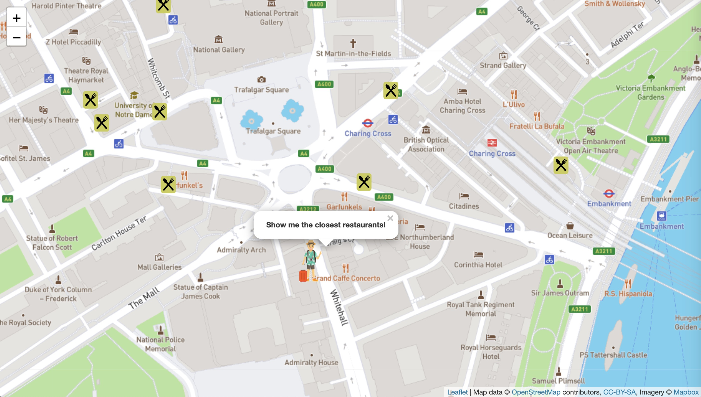
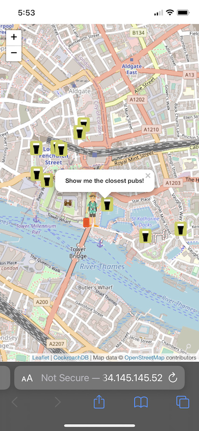
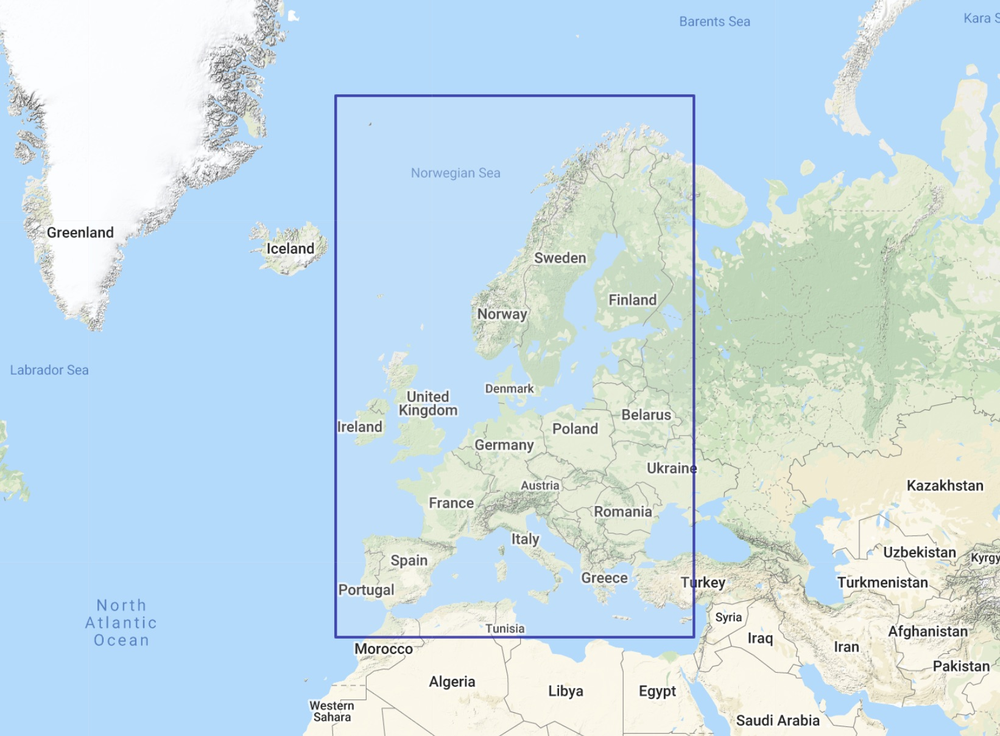

# CockroachDB Geo Tourist

## Use the spatial features in CockroachDB to find pubs, restaurants, cafes, etc.


(App shown running on a laptop)

This is a simple Python Flask and Javascript app which illustrates some of the
new spatial capabilities in CockroachDB 20.2.  The scenario is this: in the web
app, an icon represents the user, and this user is situated at a location
randomly chosen from a set of destinations, each time the page is refreshed.
Then, a REST call is made from the Javascript front end, including the type of
_amenity_ to search for as well as the user's location.  Witin the Python Flask
app, those values are featured in a SQL query against a CockroachDB instance
loaded with spatial data.  This query uses the following spatial data types,
operators, and indexes to find and return a set of the nearest amenities,
sorted by distance:

1. `GEOGRAPHY`: the data type to represent each of the `POINT` data elements associated with the amenity
1. `ST_Distance`: used to calculate the distance from the user to each of these locations
1. `ST_Y` and `ST_X`: are used to retrieve the longitude and latitude of each of these points, for plotting onto the map
1. `ST_DWithin`: used in the `WHERE` clause of the SQL query to constrain the results to points within 5km of the user's location
1. `ST_MakePoint`: converts the longitude and latitude representing the user's location into a `POINT`
1. A GIN index on the `ref_point` column in the `osm` table speeds up the calculation done by `ST_DWithin`

These types, operators, and the GIN index are familiar to users of
[PostGIS](https://postgis.net/), the popular spatial extension available for
PostgreSQL.  In CockroachDB, this layer was created from scratch and PostGIS
was not used, but the PostGIS API was preserved.

One aspect of CockroachDB's spatial capability is especially interesting: the
way the spatial index works.  In order to preserve CockroachDB's unique ability
to scale horizontally by adding nodes to a running cluster, its approach to
spatial indexing is to decompose of the space being indexed into buckets of
various sizes.  A deeper discussion of this topic is available
[here](https://www.cockroachlabs.com/docs/v20.2/spatial-indexes).


(App running in an iPhone, in Safari)

## Data

The data set is a sample of an extract of the OpenStreetMap
Planet Dump which is accessible from [here](https://wiki.openstreetmap.org/wiki/Planet.osm).
The `planet-latest.osm.pbf` file was downloaded (2020-08-01) and then processed
using [Osmosis](https://github.com/openstreetmap/osmosis/releases) as
documented in [this script](./osm/planet_osm_extract.sh).  The bounding box
specified for the extract was `--bounding-box top=72.253800 left=-12.666450 bottom=33.120960 right=34.225994`,
corresponding to the area shown in the figure below.  The result of this operation
was a 36 GB Bzip'd XML file (not included here).  This intermediate file was then
processed using [this Perl script](./osm/extract_points_from_osm_xml.pl), with the
result being piped through Gzip to produce a [smaller data
set](https://storage.googleapis.com/crl-goddard-gis/osm_1m_eu.txt.gz) consisting of 1 million points.



[DDL and sample SQL queries](./osm/osm_crdb.sql): The data set is loaded into
one table which has a primary key and one secondary index.  Here is the DDL:

```
DROP TABLE IF EXISTS osm;
CREATE TABLE osm
(
  id BIGINT
  , date_time TIMESTAMP WITH TIME ZONE
  , uid TEXT
  , name TEXT
  , key_value TEXT[]
  , ref_point GEOGRAPHY
  , geohash4 TEXT -- First 4 characters of geohash, corresponding to a box of about +/- 20 km
  , CONSTRAINT "primary" PRIMARY KEY (geohash4 ASC, id ASC)
);
CREATE INDEX ON osm USING GIN(ref_point);
```
**NOTE:** `./load_osm_stdin.py` creates the `osm` table and the GIN index if they don't already exist.

[The Flask app](./map_app.py) runs one of two variations of a query, depending
on whether the environment variable `USE_GEOHASH` is set and, if so, its value
(`true` or `false`), as shown in the following code block (line numbers have
been added here).  The main difference is that, when `USE_GEOHASH` is set to
`true`, the GIN index is not used, but rather the four character substring of
the geohash of the point is used, which effectively constrains the search area
to a +/- 20 km box (see lines 14 - 17).  This `geohash4` column is the leading
component of the primary key, so is indexed, allowing this to perform very well
while also having lower impact on data load speeds.  Now, if this query was
more complex than "find me the N closest points within a radius of X", the GIN
index would be preferable since it permits far more complex comparisons.

```
 1	  sql = """
 2	  WITH q1 AS
 3	  (
 4	    SELECT
 5	      name,
 6	      ST_Distance(ST_MakePoint(%s, %s)::GEOGRAPHY, ref_point)::NUMERIC(9, 2) dist_m,
 7	      ST_Y(ref_point::GEOMETRY) lat,
 8	      ST_X(ref_point::GEOMETRY) lon,
 9	      date_time,
10	      key_value
11	    FROM osm
12	    WHERE
13	  """
14	  if useGeohash:
15	    sql += "geohash4 = SUBSTRING(%s FOR 4)"
16	  else:
17	    sql += "ST_DWithin(ST_MakePoint(%s, %s)::GEOGRAPHY, ref_point, 5.0E+03, TRUE)"
18	  sql += """
19	      AND key_value && ARRAY[%s]
20	  )
21	  SELECT * FROM q1
22	  """
23	  if useGeohash:
24	    sql += "WHERE dist_m < 5.0E+03"
25	  sql += """
26	  ORDER BY dist_m ASC
27	  LIMIT 10;
28	  """
```

## Run the app in one of 3 ways: (1) locally, (2) locally, but with app in a Docker container, (3) in Kubernetes (K8s)

### Sign up for MapBox and get a token

To render the maps in the browser, the app uses
[Leaflet](https://leafletjs.com/) and base maps from
[MapBox](https://www.mapbox.com/).  MapBox will permit use of its maps only if you include a token
in the URL to their map tile service (within your app).  If you sign up for an account, you will
be able to generate a token. In the section below, for running locally, I had saved my token in
the file `../MapBox_Token.txt`.  For running in K8s, you'd need to edit
`./k8s/crdb-geo-tourist.yaml` and replace `INSERT YOUR MAPBOX TOKEN VALUE HERE` with your token.

### If running locally, with or without Docker

* Download, install, and start a CockroachDB cluster using version 20.2 or above.  Installation instructions
can be found [here](https://www.cockroachlabs.com/docs/stable/install-cockroachdb-mac.html), and the startup
procesure is documented [here](https://www.cockroachlabs.com/docs/v20.2/start-a-local-cluster).  The default
user is `root` and the default database is `defaultdb`, so these values don't need to be set.

* Load the data (see above) using [this script](./load_osm_stdin.py):

```
$ export PGHOST=localhost
$ export PGPORT=26257

$ curl -s -k https://storage.googleapis.com/crl-goddard-gis/osm_1m_eu.txt.gz | gunzip - | ./load_osm_stdin.py
```

### Run the app locally, without Docker

* Start the Python Flask app, which provides the data REST service and also serves the app's HTML template
and static assets (PNG, CSS, and JS files):

```
$ export MAPBOX_TOKEN=$( cat ../MapBox_Token.txt )
$ export PGHOST=localhost
$ export PGPORT=26257
```

### Run the app via its Docker image

* Edit `./docker_run_image.sh`, changing environment variables as necessary to suit your deployment.

```
$ ./docker_run_image.sh
```

Optional: stop the app, disable the use of the GIN index in favor of the
primary key index on the geoash substring, then restart the app.  Try both ways
(e.g. `unset USE_GEOHASH` vs. `export USE_GEOHASH=true`) and compare the time
it takes to load the amenity icons in the browser.

```
$ export USE_GEOHASH=true
```

### Deploy the app in Kubernetes (K8s)

* You'll need access to some K8s environment.  Here, we describe doing this in Google's GKE.
[Minikube](https://minikube.sigs.k8s.io/docs/), Amazon EKS, or Azure AKS would be viable alternatives.

* What follows is partially derived from [these docs](https://github.com/cockroachdb/cockroach/tree/master/cloud/kubernetes).

* The files in the `./k8s` subdirectory are used for a K8s deployment.  They are:
  - [`deploy_k8s.sh`](./k8s/deploy_k8s.sh): script to deploy a 4 VM K8s cluster in GKE
  - [`data-loader.yaml`](./k8s/data-loader.yaml): pod definition which loads the data
  - [`crdb-geo-tourist.yaml`](./k8s/crdb-geo-tourist.yaml): app deployment and load balancer service

* Change to the `./k8s` directory: `cd ./k8s/`

* Edit `./deploy_k8s.sh`, changing any of the following:
```
MACHINETYPE="e2-standard-2"
NAME="${USER}-geo-tourist"
ZONE="us-east4-b"
```
* I suggest stepping through that script, doing steps 1 - 3, then waiting until your `cockroach-N`
pods all show a `STATUS` of `Running`, as shown here:

```
$ kubectl get pods
NAME                                READY   STATUS      RESTARTS   AGE
cluster-init-67frx                  0/1     Completed   0          8h
cockroachdb-0                       1/1     Running     0          8h
cockroachdb-1                       1/1     Running     0          8h
cockroachdb-2                       1/1     Running     0          8h
```

* Create table, index, and load data:
```
YAML="./data-loader.yaml"
kubectl apply -f $YAML
```

Wait until `kubectl get pods` shows `Completed` for the loader process.
This should take about 10 minutes.

```
$ kubectl get pods
NAME                                READY   STATUS      RESTARTS   AGE
crdb-geo-loader                     0/1     Completed   0          7h2m
```

* Remember to edit `./crdb-geo-tourist.yaml`, replacing `INSERT YOUR MAPBOX TOKEN VALUE HERE` with your
MapBox token, and then apply this YAML file to start the Python Flask app:

```
YAML="./crdb-geo-tourist.yaml"
kubectl apply -f $YAML
```

* Once that's running, as indicated by the output of `kubectl get pods`, you can describe your load balancer
service to get its `LoadBalancer Ingress` value, which you can then paste into a web browser to view the app.
**NOTE:** it may take a few tries of running this command before that field gets populated with a value.
Here's an example:

```
$ kubectl describe service crdb-geo-tourist-lb
Name:                     crdb-geo-tourist-lb
Namespace:                default
Labels:                   <none>
Annotations:              <none>
Selector:                 app=crdb-geo-tourist
Type:                     LoadBalancer
IP:                       10.63.243.111
LoadBalancer Ingress:     35.188.226.10
Port:                     <unset>  80/TCP
TargetPort:               18080/TCP
NodePort:                 <unset>  32456/TCP
Endpoints:                10.60.2.7:18080,10.60.3.7:18080
Session Affinity:         None
External Traffic Policy:  Cluster
Events:
  Type    Reason                Age    From                Message
  ----    ------                ----   ----                -------
  Normal  EnsuringLoadBalancer  8m40s  service-controller  Ensuring load balancer
  Normal  EnsuredLoadBalancer   8m1s   service-controller  Ensured load balancer
```

### If you need to rebuild the Docker image

Edit Dockerfile as necessary, and then change `./docker_include.sh` to set
`docker_id` and anything else you'd like to change.

```
$ ./docker_build_image.sh
$ ./docker_tag_publish.sh

```

